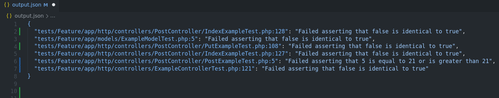

# Pest PHP Intermittent Find
<h1 align="center">
  
</h1>

## Result file example
<h1 align="center">
  
</h1>

<p align="center">This project aims to find intermittent tests at your php project</p>
<p align="left">The result following that pattern</p>

```json
{ 
  "Test/File/Name.php:line_number": "Test Error Message"
}
```


## Prerequisites

1. Rust
2. Cargo
1. PHP and PestPHP Project


## How to use
- In the /files folder put your composer.json and or package.json
- Run:
```bash
 cargo run
```
- See the output.json file


## Contribute
Help me to make this project more complete and effective, I've suffered many times with this problem and I believe you too.